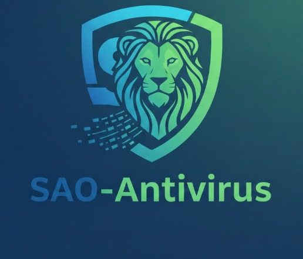

<div align="center">
  
  
  <h1>SAO-ANTIVIRUS | GUARDIAN EDITION</h1>

  <a href="#">
    
  </a>
  <a href="#">
    
  </a>
  <a href="#">
    
  </a>

  <br><br>

  <p>
    <b>Solución Híbrida de Detección y Respuesta (EDR) de Código Abierto.</b>
  </p>
  
  <p>
    Diseñado con una arquitectura modular que combina análisis de firmas estáticas con un motor heurístico de Inteligencia Artificial para la detección de anomalías, Ransomware y amenazas de día cero.
  </p>

  <br>

  <h3>Language</h3>
  

</div>

---

## Technical Overview

SAO-Antivirus (Guardian Edition) no es solo una interfaz gráfica. Es un sistema de defensa activo que opera bajo el principio de "Cero Confianza".

* **Hybrid Core:** El núcleo del sistema detecta automáticamente el sistema operativo (Windows/Linux) y ajusta sus drivers de monitoreo.
* **Stream Scanning:** Implementación de lectura de archivos por flujo (chunks de 64KB) para analizar grandes volúmenes de datos sin impactar la memoria RAM.
* **Entropy Analysis:** Algoritmo matemático que mide la aleatoriedad de los archivos para identificar patrones de cifrado malicioso (Ransomware) antes de que se ejecuten.
* **OTA Updates:** Sistema de actualización "Over-The-Air" que sincroniza el cliente con el repositorio central para parches de seguridad inmediatos.

## Installation

### Windows (Client)
1.  Descarga el ejecutable `Setup_SAO_Antivirus.exe` desde la sección **Releases**.
2.  Ejecuta el instalador con permisos de Administrador.
3.  El sistema configurará automáticamente el Watchdog y el servicio en segundo plano.

### Linux (Root / Headless)
Compatible con Debian, Ubuntu, Kali Linux y derivados.

```bash
# 1. Clonar repositorio o descargar fuente
git clone [https://github.com/sao2139/SAO-Antivirus-Master.git](https://github.com/sao2139/SAO-Antivirus-Master.git)

# 2. Dar permisos de ejecución al instalador
chmod +x install.sh

# 3. Instalar (Requiere Root)
sudo ./install.sh

# 4. Iniciar
sao-av